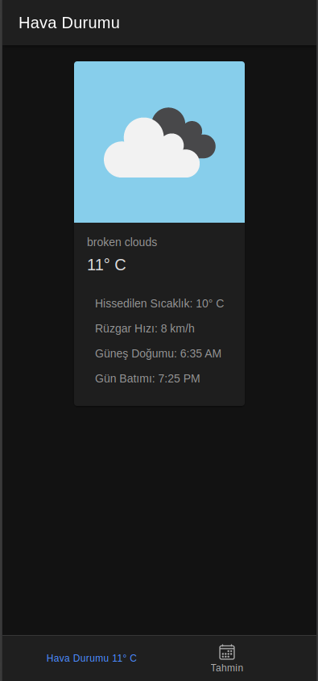
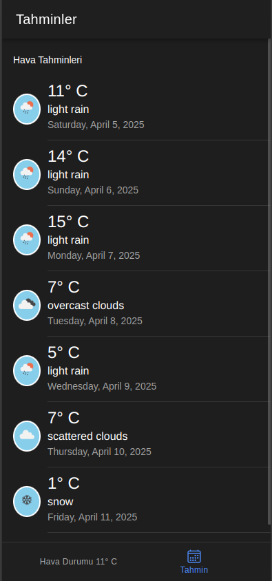

# 🌤️ Hava Durumu Uygulaması

Bu proje, **Ionic Framework** ve **Vue.js** kullanılarak geliştirilmiş basit ve kullanıcı dostu bir hava durumu uygulamasıdır. Uygulama iki ana sayfadan oluşur:

- **Ana Sayfa**: Cihazın bulunduğu ilin anlık hava durumu bilgilerini gösterir.
- **Haftalık Sayfa**: Aynı ilin haftalık hava durumu tahminlerini listeler.

## 🚀 Özellikler

- Güncel hava durumu verileri
- Haftalık tahminler
- Temiz ve sade kullanıcı arayüzü
- Mobil uyumlu yapı (Ionic ile)

## 🛠️ Kullanılan Teknolojiler

- [Ionic Framework](https://ionicframework.com/)
- [Vue.js](https://vuejs.org/)
- [OpenWeather API](https://openweathermap.org/) *(veya kullandığın başka bir hava durumu API'si)*

## 📱 Ekran Görüntüleri

# weather-app
